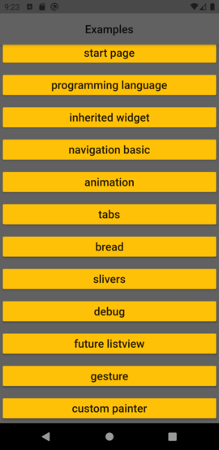
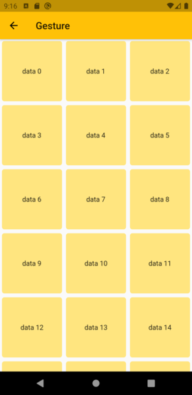
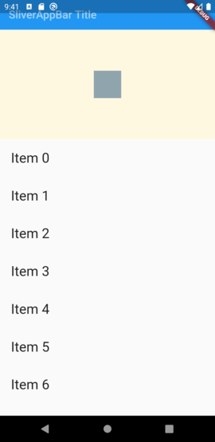
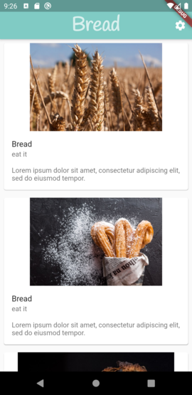
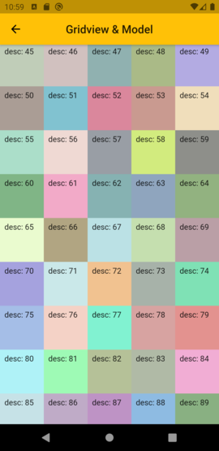

# flutter
* project constructed with IntelliJ IDEA. vscode with flutter and dart extension works also good. even better.
* you can also create a flutter project with flutter sdk: `flutter create`
* when using IntelliJ ensure that you installed the flutter plugin: `Configure > Plugins > search flutter`
* focus is __Android__ target. So in that case ensure that you installed android sdk. this will provide an android emulator which you can use to run your flutter app.
* you will find your dart code in `lib/` folder
* `flutter -v` will give a detailed list of the settings: android studio, toolchain, flutter, ...
* think in widgets in flutter. everything is a widget. you want an app? then create a class which inherit the widgets class.
* in flutter you mainly work with stateless (immutable, properties are final) and stateful widgets.
* with flutter creating an app is like creating a html page. 
* android kotlin with __jetpack compose__ `@Composable, @Preview, @Model` is going the same way.
    * https://developer.android.com/jetpack/compose

Web
---
* add web app support to existing app: `flutter create .`
* https://flutter.dev/docs/get-started/web

Screenshot
-----------
* take screenshot
```
flutter screenshot
```
* resize 
```
convert -resize 25% i.png o.png
```
\
__Start__
\

\
__Grid Example__
\

\
__Slivers Example__
\

\
__Animation Package Example__
\

\
__Grivview Model Example__
\

